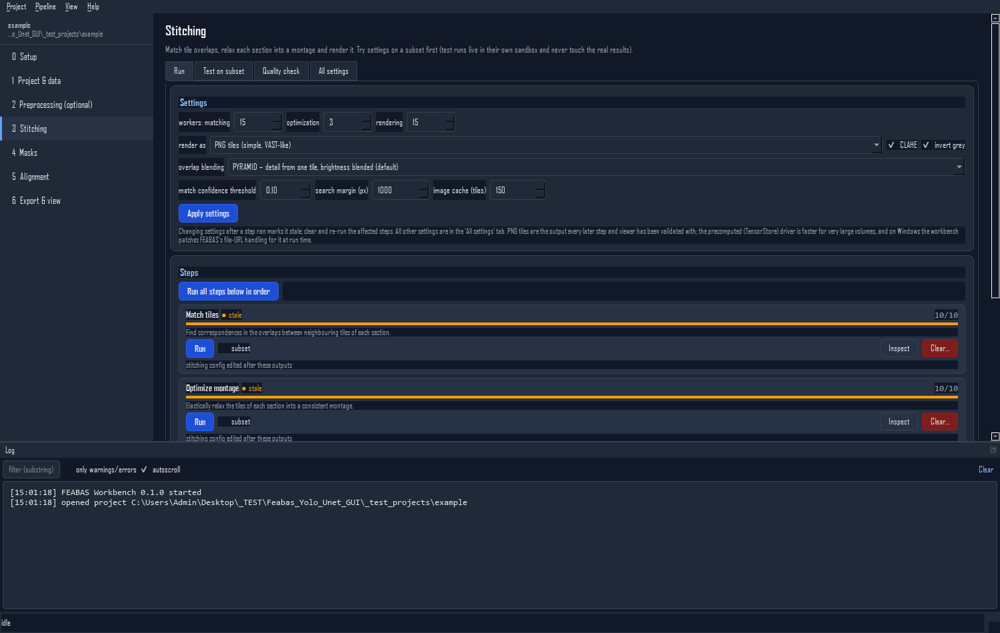
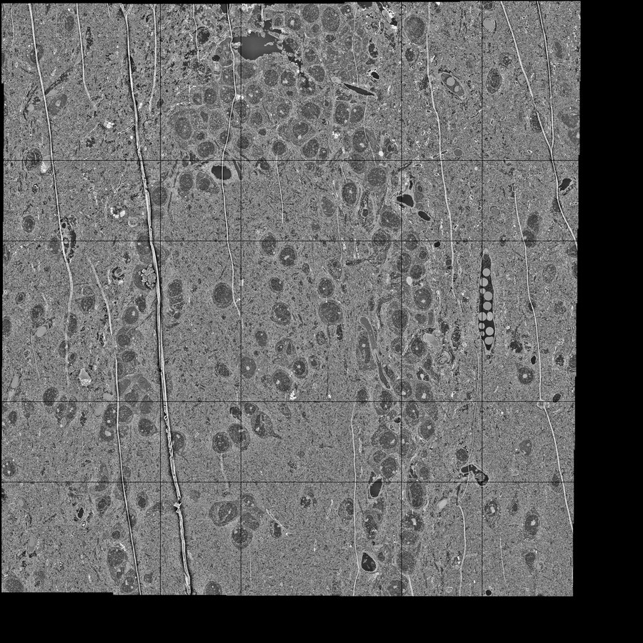
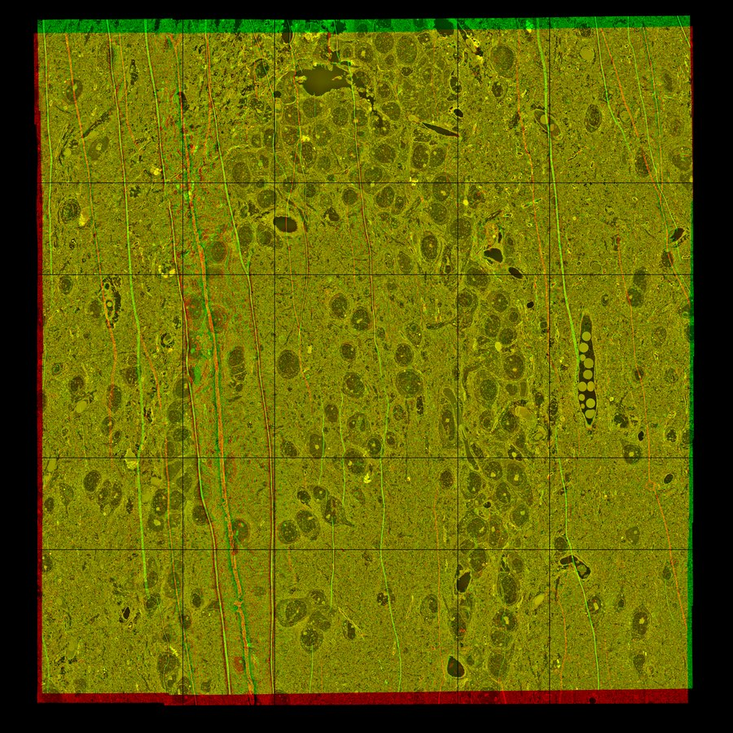
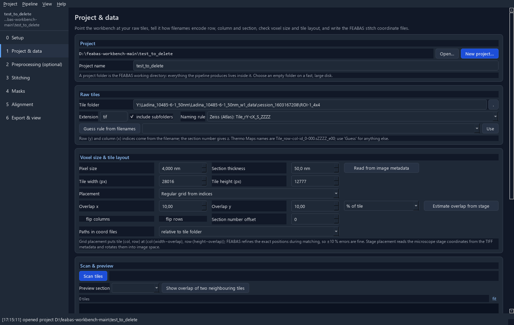
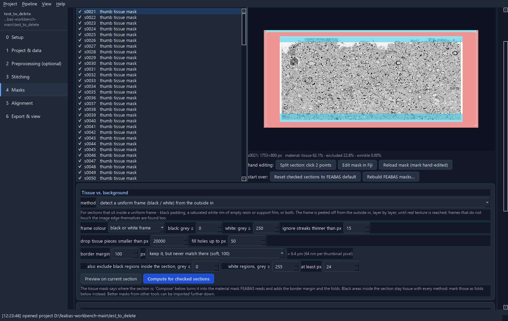
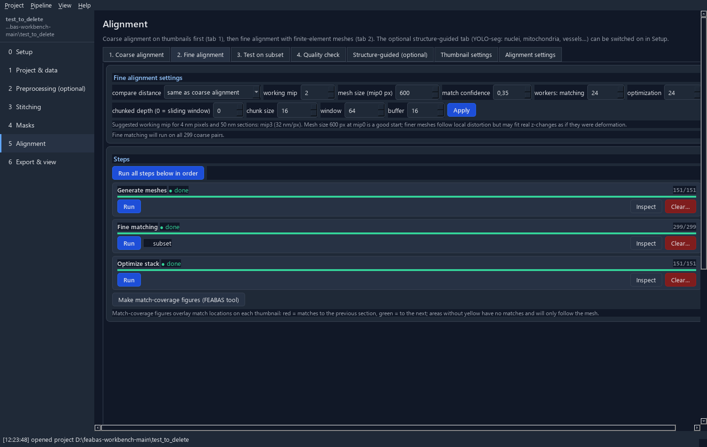
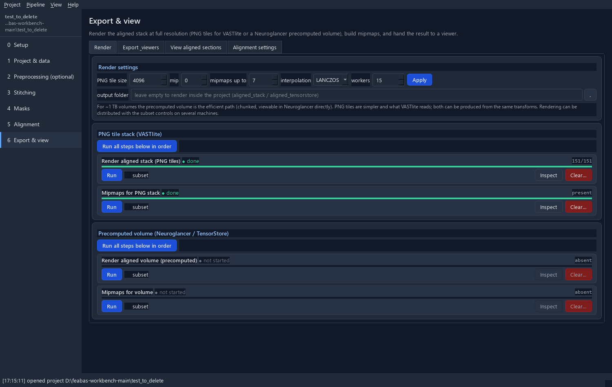

<h1 align="center">FEABAS Workbench</h1>

<p align="center">
  A desktop app for stitching and aligning serial-section EM volumes with
  <a href="https://github.com/YuelongWu/feabas">FEABAS</a> – for people who do not want to touch YAML files or a terminal.
</p>

<p align="center">
  <a href="https://github.com/georgkislinger/feabas-workbench/actions/workflows/ci.yml"></a>
  
  
  
  <a href="LICENSE"></a>
</p>

<p align="center">
  
</p>

FEABAS (Yuelong Wu, MIT) is a state-of-the-art pipeline for stitching and elastically aligning
serial-section electron-microscopy data. It is driven from the command line by YAML files. The workbench
wraps it in seven windows, one per stage, and adds the parts the command line leaves to you: reading tile
positions out of microscope metadata, building the masks, test runs on subsets, quality overlays, rolling
back, and exporting to a viewer.

FEABAS itself is not modified: its driver scripts (3.0.5) are vendored and run as subprocesses in your
FEABAS environment with the project folder as working directory.

## What it does

| Window | What happens there |
|---|---|
| **0 Setup** | Finds or installs the Python environments (FEABAS; PyTorch + CAREamics + ultralytics + segmentation-models-pytorch), checks the GPU, remembers where Fiji and VASTlite are. |
| **1 Project & data** | Points at the raw tiles, guesses how filenames encode row/column/section (Thermo Maps, Zeiss Atlas, sequential numbers, custom pattern), reads pixel size and stage positions from the TIFF metadata, previews the layout, writes FEABAS's `stitch_coord` files. |
| **2 Preprocessing** | Optional histogram matching to a template and CAREamics Noise2Void / N2V2 / StructN2V denoising trained on tiles you pick. |
| **3 Stitching** | Tile matching, montage optimisation and rendering with the settings that matter up front; test runs on a few sections and tiles in a sandbox; a full-resolution viewer for seams; every other setting in a documented tree editor. |
| **4 Masks** | Thumbnails, tissue-vs-background masks (tile footprint, a black/white frame peeled from the outside in, fixed margins, or texture/intensity — each method shows only its own settings), fold detection with the bundled U-Net (or one you train here), import of masks made elsewhere, composition into FEABAS's material mask, split lines for broken sections, hand editing in Fiji. |
| **5 Alignment** | Coarse (thumbnail) and fine (finite-element) alignment with its own compare distance, sandbox test runs, red/green and checkerboard overlays, and — optional, switched on in Setup — **structure-guided alignment**: a YOLO-seg model finds nuclei / mitochondria / vessels and the alignment is driven from them. |
| **6 Export & view** | Full-resolution PNG tiles or a Neuroglancer precomputed volume, mipmaps, VASTlite export (`.vsvi`, hard-linked, instant), OME-Zarr, open in VASTlite / Fiji / Neuroglancer. |

Across all of them: pipeline state is read from the files on disk (done / partly done / stale / errors /
blocked), **clear a step and everything after it**, **snapshots** to roll back to, a log with FEABAS's
own messages, cancellable jobs, and subset runs (`--start/--stop/--step`) for spreading work over machines.

## What the result looks like

The example dataset used during development: 10 serial sections, 8 × 5 tiles of 6144 × 4096 px at
10 nm as written by a Thermo Fisher microscope, through the whole pipeline with default settings.

<table>
  <tr>
    <td align="center"><br><sub>One stitched section, 32 768 × 32 768 px, from 40 tiles.</sub></td>
    <td align="center"><br><sub>Two consecutive aligned sections in red and green: yellow where they coincide.</sub></td>
  </tr>
</table>

<details>
<summary>More windows</summary>
<p align="center">
  <br>
  <br>
  <br>
  
</p>
</details>

## Install

Get the code (**Code → Download ZIP**, or `git clone`), unpack it, then pick the row that matches your
machine. The heavy parts – FEABAS and PyTorch – go into separate environments that the app creates for you
afterwards, so this only concerns the GUI.

| You already have | Do this |
|---|---|
| **nothing** | install [Miniforge](https://conda-forge.org/download/) (defaults are fine), then the next row |
| **micromamba / Miniforge / Miniconda / Anaconda** | Windows: double-click `tools\install.bat` · Linux/macOS: `bash tools/install.sh` — finds the package manager, creates the `feabas-workbench` env, installs the app and hard-wires `start_gui.bat` / `start_gui.sh` to it |
| **plain Python ≥ 3.10**, no conda | `python -m venv .venv` then `.venv\Scripts\python -m pip install -e .` (Linux: `.venv/bin/python`) |

Start with **`start_gui.bat`** (Windows) or **`./start_gui.sh`** (Linux/macOS); both find the `.venv` or
the conda environment on their own. In the app, open **Setup**: *Detect environments* finds existing
FEABAS / PyTorch environments; otherwise *Install fw-feabas* and *Install fw-dl* create them (internet
needed; several GB for the deep-learning one). Without conda, the Setup page can download micromamba for that.

> [!TIP]
> Linux desktops have the Qt libraries already. On a minimal server install add
> `sudo apt install libegl1 libopengl0 libxkbcommon0 libdbus-1-3 libxcb-cursor0 libfontconfig1`.

The full version with every option, and every window and setting explained – what it does, when to
change it, what it makes stale – is the **[user guide](docs/USER_GUIDE.md)**. The same text as a page
with a contents rail and search is [`docs/user_guide.html`](docs/user_guide.html): open it in a browser
from your download.

## A typical run

1. **Project & data** – *New project* (an empty folder on a big disk) → tile folder → *Guess rule* →
   *Read from image metadata* → *Scan tiles* → check the preview → *Write stitch_coord files*.
2. **Stitching** – set workers and render driver → *Run all*. For a new dataset, first *Test on subset*
   with one section and a few tiles, look at the seams, then run for real.
3. **Masks** – *Make thumbnails* (about 500–2000 px; the suggested mip does that) → tissue rule →
   *Detect folds* → *Compose*. Check a few sections with the overlay; paint split lines through broken sections.
4. **Alignment** – *Match thumbnails* → *Optimize coarse stack* → *Render coarse stack* → check red/green →
   *Generate meshes* → *Fine matching* → *Optimize stack*.
5. **Export & view** – render PNG tiles + mipmaps → *Export* (VAST) → *Open in VASTlite*; or render the
   precomputed volume and open it in Neuroglancer.

When something upstream changes, the affected steps show **stale**; *Clear…* on the earliest affected step
lists what will be deleted, then re-run. Make a snapshot first if the previous state was valuable.

### Structure-guided alignment

Off by default (Setup → Interface shows the tab). With a YOLO-seg model (bring `.pt` weights, or train on a YOLO-format dataset from the
Alignment window): *Detect structures* on thumbnails, then *Match structures* – centroids of the same
structures in neighbouring sections become coarse matches, either added to FEABAS's feature matches with a
weight or used instead of them where they succeed. For fine alignment, *restrict* turns tissue outside the
structures into a low-stiffness material, or *Re-weight fine matches* damps the matches outside them.
The idea: let the user say what the alignment should be driven from – nuclei, mitochondria, vessels –
instead of features they cannot see.

<details>
<summary>Layout of a project folder</summary>

```
project/
  workbench_project.json     workbench state (source folder, naming rule, voxel size, settings)
  configs/                   general_configs.yaml (points FEABAS here), default_*.yaml, your overrides
  stitch/stitch_coord/       one TSV per section (input to FEABAS)
  stitch/, stitched_sections/, thumbnail_align/, align/, aligned_stack/, logs/   FEABAS outputs
  preprocessed/{histmatch,denoised}/   preprocessed tiles mirroring the raw folder
  masks/{tissue,folds,structures}/     intermediate masks; manifest.json marks hand-edited ones
  models/{n2v,folds,yolo}/             trained models
  tests/<name>/              sandbox working directories for subset test runs
  snapshots/<stamp>/         rollback copies of matches/meshes/transforms/configs
  exports/                   VAST / OME-Zarr exports
```

The project folder *is* the FEABAS working directory. Your raw tiles stay where they are.
</details>

## Development

```bash
python -m pytest tests -q                                    # core tests + offscreen GUI smoke test
python -m feabas_workbench --project X --screenshot out/     # render every window offscreen
python -m build                                              # wheel + sdist
pyinstaller tools/feabas_workbench.spec                      # GUI-only executable (environments stay external)
```

CI runs the tests, the offscreen render and the package build on Ubuntu and Windows for Python 3.11
and 3.12, and checks that the FEABAS run-time patch applies on Linux.

Code map: `feabas_workbench/core` (Qt-free: project, tiles, configs, steps, jobs, masks, images, test runs,
environments), `feabas_workbench/workers` (subprocess workers: histogram matching, N2V, fold U-Net, YOLO,
structure matching, match re-weighting, export), `feabas_workbench/ui` (PySide6 pages and widgets),
`feabas_workbench/vendor/feabas_3_0_5` (FEABAS driver scripts, tools and default configs),
`feabas_workbench/resources` (the bundled fold U-Net weights: an fp16 export with every model weight, so it
detects and can be fine-tuned; only the original training run's optimizer state is not included, which
only matters for resuming that run — the full 280 MB checkpoint is not bundled).

## Credits and license

This is a front end for **[FEABAS](https://github.com/YuelongWu/feabas)** by Yuelong Wu (Center for
Brain Science, Harvard University), which does the actual stitching and alignment. FEABAS is MIT-licensed;
its driver scripts and default configuration files are vendored here unchanged, with their license, under
`feabas_workbench/vendor/feabas_3_0_5/` (see [THIRD_PARTY_NOTICES.md](THIRD_PARTY_NOTICES.md)).

The workbench is released under the [MIT License](LICENSE).
